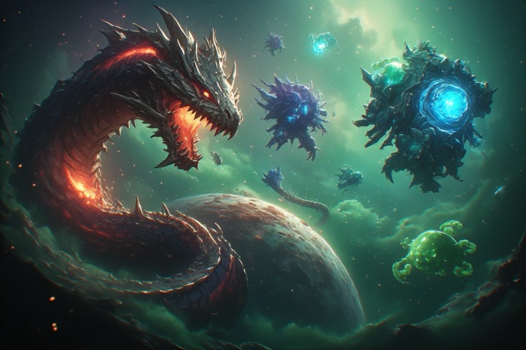

# Чудовища Бездны



```
Придумай механику расширения для модификации OGame - "Левиафаны". 
Это гигантские космические чудовища: Амёба, Страж и Левиафан.
По сути они являются объектами галактики и перемещаются по ней. При при приближении к обитаемой планетной системе происходит автоматическая битва.
Продумай технические параметры каждого левиафана, вот таблица параметров обычных юнитов:
$UnitParam = array (        // structure, shield, attack, cargo capacity, speed, consumption
    GID_F_SC => array ( 4000, 10, 5, 5000, 5000, 10 ),
    GID_F_LC => array ( 12000, 25, 5, 25000, 7500, 50 ),
    GID_F_LF => array ( 4000, 10, 50, 50, 12500, 20 ),
    GID_F_HF => array ( 10000, 25, 150, 100, 10000, 75 ),
    GID_F_CRUISER => array ( 27000, 50, 400, 800, 15000, 300 ),
    GID_F_BATTLESHIP => array ( 60000, 200, 1000, 1500, 10000, 500 ),
    GID_F_COLON => array ( 30000, 100, 50, 7500, 2500, 1000 ),
    GID_F_RECYCLER => array ( 16000, 10, 1, 20000, 2000, 300 ),
    GID_F_PROBE => array ( 1000, 0, 0, 5, 100000000, 1 ),
    GID_F_BOMBER => array ( 75000, 500, 1000, 500, 4000, 1000 ),
    GID_F_SAT => array ( 2000, 1, 1, 0, 0, 0 ),
    GID_F_DESTRO => array ( 110000, 500, 2000, 2000, 5000, 1000 ),
    GID_F_DEATHSTAR => array ( 9000000, 50000, 200000, 1000000, 100, 1 ),
    GID_F_BATTLECRUISER => array ( 70000, 400, 700, 750, 10000, 250 ),

    GID_D_RL => array ( 2000, 20, 80, 0, 0, 0 ),
    GID_D_LL => array ( 2000, 25, 100, 0, 0, 0 ),
    GID_D_HL => array ( 8000, 100, 250, 0, 0, 0 ),
    GID_D_GAUSS => array ( 35000, 200, 1100, 0, 0, 0 ),
    GID_D_ION => array ( 8000, 500, 150, 0, 0, 0 ),
    GID_D_PLASMA => array ( 100000, 300, 3000, 0, 0, 0 ),
    GID_D_SDOME => array ( 20000, 2000, 1, 0, 0, 0 ),
    GID_D_LDOME => array ( 100000, 10000, 1, 0, 0, 0 ),

    GID_D_ABM => array ( 8000, 1, 1, 0, 0, 0 ),
    GID_D_IPM => array ( 15000, 1, 12000, 0, 0, 0 ),
);

У левиафанов также должен быть большой скорострел, вот таблица скорострела юнитов:

$RapidFire = array (
    GID_F_SC => array ( GID_F_PROBE => 5, GID_F_SAT => 5 ),
    GID_F_LC => array ( GID_F_PROBE => 5, GID_F_SAT => 5 ),
    GID_F_LF => array ( GID_F_PROBE => 5, GID_F_SAT => 5 ),
    GID_F_HF => array ( GID_F_SC => 3, GID_F_PROBE => 5, GID_F_SAT => 5 ),
    GID_F_CRUISER => array ( GID_F_LF => 6, GID_F_PROBE => 5, GID_F_SAT => 5, GID_D_RL => 10 ),
    GID_F_BATTLESHIP => array ( GID_F_PROBE => 5, GID_F_SAT => 5 ),
    GID_F_COLON => array ( GID_F_PROBE => 5, GID_F_SAT => 5 ),
    GID_F_RECYCLER => array ( GID_F_PROBE => 5, GID_F_SAT => 5 ),
    GID_F_PROBE => array ( ),
    GID_F_BOMBER => array ( GID_F_PROBE => 5, GID_F_SAT => 5, GID_D_RL => 20, GID_D_LL => 20, GID_D_HL => 10, GID_D_ION => 10 ),
    GID_F_SAT => array ( ),
    GID_F_DESTRO => array ( GID_F_PROBE => 5, GID_F_SAT => 5, GID_F_BATTLECRUISER => 2, GID_D_LL => 10 ),
    GID_F_DEATHSTAR => array ( GID_F_SC => 250, GID_F_LC => 250, GID_F_LF => 200, GID_F_HF => 100, GID_F_CRUISER => 33, GID_F_BATTLESHIP => 30, 
        GID_F_COLON => 250, GID_F_RECYCLER => 250, GID_F_PROBE => 1250, GID_F_BOMBER => 25, GID_F_SAT => 1250, GID_F_DESTRO => 5, GID_F_BATTLECRUISER => 15, 
        GID_D_RL => 200, GID_D_LL => 200, GID_D_HL => 100, GID_D_GAUSS => 50, GID_D_ION => 100 ),
    GID_F_BATTLECRUISER => array ( GID_F_SC => 3, GID_F_LC => 3, GID_F_HF => 4, GID_F_CRUISER => 4, GID_F_BATTLESHIP => 7, GID_F_PROBE => 5, GID_F_SAT => 5 ),
    // The defense doesn't feature rapid-fire
    GID_D_RL => array ( ),
    GID_D_LL => array ( ),
    GID_D_HL => array ( ),
    GID_D_GAUSS => array ( ),
    GID_D_ION => array ( ),
    GID_D_PLASMA => array ( ),
    GID_D_SDOME => array ( ),
    GID_D_LDOME => array ( ),
);

После уничтожения Амёбы должно выпадать много дейтерия, Стража - кристалла, а Левиафана - металла.
Также в названии мода есть "Левиафаны" и один монстр с таким же именем, предложи ещё несколько названий мода.
Продумай алгоритм перемещения каждого левиафана по галактикам (механику смены координат G, S, P и частоту смены). Каждый левифан должен обладать уникальным правилом перемещения.
```

Отличная идея для мода! Предлагаю детальную проработку механики.

Альтернативные названия мода
Космические Исполины (более эпичное и научно-фантастическое)

Чудовища Бездны (делает акцент на их угрозе и таинственности)

Ктулху в Космосе / Порождения Хаоса (отсылка к мифам Лавкрафта)

Галактические Хищники (подчеркивает их поведение)

Охотники за Системами (описывает их основную игровую функцию)

Механика перемещения Левиафанов
Каждый Левиафан существует в единственном экземпляре на всю вселенную. Его координаты (Галактика, Система, Позиция) обновляются по расписанию (например, каждые 15-30 минут реального времени). Алгоритм уникален для каждого.

Амёба (Планктонный Пожиратель)

Механика: Дрейфует в космических течениях. Её движение наименее предсказуемо в пределах системы, но она редко покидает галактику.

Алгоритм: При обновлении координат с вероятностью 70% меняет только Позицию (P) в пределах 1-15, с вероятностью 25% меняет Систему (S) в пределах ±5 от текущей, и с вероятностью 5% меняет Галактику (G) на ±1.

Частота обновления: Каждые 20 минут. Часто "болтается" в одном секторе галактики.

Страж (Блуждающий Монолит)

Механика: Патрулирует границы галактик, двигаясь по упорядоченной, почти "логической" траектории.

Алгоритм: Движется по спирали. Начинает с края галактики (например, G=1, S=1, P=1). Сначала проходит все Позиции (P) в системе, затем переходит на следующую Систему (S). Дойдя до конца галактики (напр., S=499), увеличивает Галактику (G) на 1 и начинает движение в обратном направлении по системам (с 499 до 1).

Частота обновления: Каждые 15 минут. Его путь можно предсказать, если отслеживать.

Левиафан (Галактический Кит)

Механика: Совершает грандиозные, стремительные прыжки через огромные расстояния, имитируя миграцию.

Алгоритм: При обновлении координат с вероятностью 60% совершает "прыжок" в случайную Галактику (G) в пределах вселенной. Оказавшись в галактике, он выбирает случайную Систему (S) в её центре (например, в диапазоне 100-400) и случайную Позицию (P).

Частота обновления: Каждые 30-45 минут (случайный интервал). Самый непредсказуемый и опасный, может появиться где угодно.

Примечание: Левиафаны не занимают позицию планеты. Они "висят" в координатах как отдельный объект. Битва запускается, если их текущие координаты (G, S) совпадают с координатами игрока, и Позиция (P) Левиафана находится в диапазоне, например, ±3 от позиции планеты игрока.

Технические параметры Левиафанов
Формат: array ( структура, щит, атака, грузоподъемность, скорость, потребление )

Грузоподъемность здесь трактуется как "вместимость желудка" - урон, который нужно нанести, чтобы победить.

Потребление условно, можно заменить на "энергетическую сигнатуру".

1. Амёба (Planktonic Devourer)
Концепция: Слабая, но быстро размножающаяся угроза. Поглощает дейтерий.

Параметры: array ( 800000, 500, 100, 2000000, 100, 1 )

Скорострел:

php
GID_LEVI_AMOEBA => array (
    GID_F_SC => 1000,
    GID_F_LC => 1000,
    GID_F_LF => 500,
    GID_F_HF => 500,
    GID_F_CRUISER => 100,
    GID_F_RECYCLER => 1000,
    GID_F_PROBE => 5000,
    GID_F_SAT => 5000,
    GID_D_ABM => 100,
),
Особенность: Эффективна против массы легких юнитов. Уничтожает переработчики и зонды с огромным скорострелом.

Добыча: При уничтожении с вероятностью 100% "сбрасывает" 2.000.000 дейтерия, который автоматически распределяется между атакующими флотами пропорционально нанесенному урону.

2. Страж (Wandering Monolith)
Концепция: Сбалансированный, тяжелый противник с мощной защитой. Поглощает кристалл.

Параметры: array ( 5000000, 100000, 5000, 10000000, 500, 1 )

Скорострел:

php
GID_LEVI_GUARDIAN => array (
    GID_F_BATTLESHIP => 50,
    GID_F_BOMBER => 20,
    GID_F_DESTRO => 10,
    GID_F_BATTLECRUISER => 30,
    GID_D_GAUSS => 20,
    GID_D_ION => 50,
    GID_D_PLASMA => 5,
),
Особенность: Специализируется на уничтожении тяжелых кораблей и высокоуровневой обороны. Опасен для развитых игроков.

Добыча: При уничтожении с вероятностью 100% "сбрасывает" 8.000.000 кристалла.

3. Левиафан (Galactic Juggernaut)
Концепция: Абсолютная эндгейм-угроза, аналог "босса". Поглощает металл.

Параметры: array ( 30000000, 500000, 30000, 50000000, 50, 1 )

Скорострел:

php
GID_LEVI_JUGGERNAUT => array (
    GID_F_CRUISER => 150,
    GID_F_BATTLESHIP => 100,
    GID_F_BOMBER => 75,
    GID_F_DESTRO => 50,
    GID_F_DEATHSTAR => 10, // Звезда Смерти может с ним бороться!
    GID_F_BATTLECRUISER => 100,
    GID_D_GAUSS => 100,
    GID_D_ION => 200,
    GID_D_PLASMA => 50,
    GID_D_LDOME => 10,
),
Особенность: Универсальный кошмар. Имеет скорострел против всего, что может представлять угрозу. Битва с ним должна требовать объединения флотов нескольких топ-игроков.

Добыча: При уничтожении с вероятностью 100% "сбрасывает" 30.000.000 металла.

Дополнительные механики и правила
Обнаружение: Левиафаны видны в галактике только при уровне шпионажа 15+. Без этого показывается как "Неизвестный объект".

Битва: Автоматическая битва происходит при совпадении координат. Флот игрока не может сбежать (скорость Левиафанов считается бесконечной для расчета побега). Битва идет по стандартным правилам OGame, пока один из сторон не будет уничтожен.

Флот игрока: После битвы, если игрок победил, его флот остается на орбите планеты. Если проиграл - остатки разбегаются (как обычно).

Оповещение: Можно добавить опцию "Сканер Левиафанов" (улучшение в лаборатории), которое будет уведомлять игрока, если один из монстров появился в его галактике или в соседних системах.

Возрождение: Убитый Левиафан возрождается в случайной точке вселенной через 24-72 реальных часа, чтобы сохранить динамику игры.

Эта механика добавит в OGame элемент непредсказуемой PvE-угрозы, цель для объединения альянсов и новый мощный источник ресурсов для топ-игроков.

```
что-то характеристики не очень. Нужно чтобы амёбу мог победить 100Г флот, стража - 200Г, а левиафана - 400Г флот
```

Отличная правка! Нужно отталкиваться от конкретной силы флота. Давайте приведем параметры в соответствие.

Уточнение концепции флота
"Г" — это условная единица. Примем за основу силу атаки флота.

Для простоты расчета: Флот должен пробить структуру (броню) левиафана.

Игрок теряет часть флота, но если его суммарная атака превышает структуру левиафана, он побеждает.

Переработанные параметры Левиафанов
Базовые формулы:

Амёба: Победит флот с общей атакой ~100.000.000 (100 "Г").

Страж: Победит флот с общей атакой ~200.000.000 (200 "Г").

Левиафан: Победит флот с общей атакой ~400.000.000 (400 "Г").

Коэффициент сложности: Чтобы флот нес потери, структура (HP) Левиафана должна быть в 2-3 раза выше требуемой силы атаки. Его собственная атака должна быть способна уничтожать корабли за несколько раундов.

1. Амёба (Планктонный Пожиратель)
Концепция: Слабая, но многочисленная угроза. Уязвима для тяжелых кораблей, но быстро "сжирает" легкую технику.

Параметры: array ( 250000000, 10000, 5000, 0, 100, 0 )

Структура: 250.000.000 (Флоту нужно нанести такой урон. При атаке 100М - потребуется ~3 раунда).

Щит: 10.000 (Практически символический, нужен для механики боя).

Атака: 5.000 (Убивает легкие истрыбытели за 1-2 выстрела, тяжелым наносит умеренный урон).

Скорострел:

php
GID_LEVI_AMOEBA => array (
    GID_F_SC => 1000,
    GID_F_LC => 1000,
    GID_F_LF => 500,
    GID_F_HF => 300,
    GID_F_RECYCLER => 1000,
    GID_F_PROBE => 5000,
    GID_F_SAT => 5000,
    GID_D_RL => 500,
    GID_D_LL => 200,
    GID_D_ABM => 100,
),
Добыча: 2.500.000 Дейтерия.

2. Страж (Блуждающий Монолит)
Концептие: Сбалансированный "танк". Очень прочный, с мощной атакой против тяжелых целей.

Параметры: array ( 600000000, 100000, 50000, 0, 500, 0 )

Структура: 600.000.000 (Требуемая сила атаки флота ~200М).

Щит: 100.000 (Уже ощутимый, поглощает часть урона от легких кораблей).

Атака: 50.000 (Опасна для большинства кораблей).

Скорострел:

php
GID_LEVI_GUARDIAN => array (
    GID_F_BATTLESHIP => 100,
    GID_F_BOMBER => 50,
    GID_F_DESTRO => 30,
    GID_F_BATTLECRUISER => 75,
    GID_F_CRUISER => 150,
    GID_D_GAUSS => 30,
    GID_D_ION => 100,
    GID_D_PLASMA => 10,
    GID_D_SDOME => 5,
),
Добыча: 10.000.000 Кристалла.

3. Левиафан (Галактический Кит)
Концепция: Абсолютный босс. Чудовищная живучесть и атака, бьет по всем типам целей.

Параметры: array ( 1200000000, 500000, 250000, 0, 50, 0 )

Структура: 1.200.000.000 (Требуемая сила атаки флота ~400М).

Щит: 500.000 (Серьезная защита, делает бессмысленной атаку мелкими группами).

Атака: 250.000 (Может уничтожать даже Линкоры и Уничтожители за 1-2 попадания).

Скорострел:

php
GID_LEVI_JUGGERNAUT => array (
    // Почти по всем кораблям
    GID_F_LF => 500,
    GID_F_HF => 400,
    GID_F_CRUISER => 200,
    GID_F_BATTLESHIP => 150,
    GID_F_BOMBER => 100,
    GID_F_DESTRO => 75,
    GID_F_BATTLECRUISER => 125,
    // Против Звезды Смерти - ключевой боец против него
    GID_F_DEATHSTAR => 5,
    // Против обороны
    GID_D_HL => 300,
    GID_D_GAUSS => 100,
    GID_D_ION => 250,
    GID_D_PLASMA => 50,
    GID_D_SDOME => 20,
    GID_D_LDOME => 5,
),
Добыча: 40.000.000 Металла.

Примерные расчеты для флотов
Против Амёбы (250М структуры):

Флот "100Г": ~3300 Уничтожителей (GID_F_DESTRO, атака 2000) = 6.600.000 атаки за раунд. Победа за ~1-2 раунда с минимальными потерями.

Но если вести 5000 Тяж.Истрыбителей (атака 150) = 750.000 атаки, они будут массово гибнуть из-за скорострела 300, и флот проиграет.

Против Стража (600М структуры):

Флот "200Г": ~6500 Уничтожителей (13.000.000 атаки) или комбинация из 2000 Уничтожителей + 5000 Линкоров.

Потери будут значительными из-за высокого урона и скорострела Стража по тяжелым кораблям.

Против Левиафана (1.2ММ структуры):

Флот "400Г": Требуется объединение флотов нескольких топ-игроков.

Идеальный состав: 13.000+ Уничтожителей (26М атаки/раунд) + 500-1000 Звезд Смерти (ключевой боец, т.к. у Левиафана низкий скорострел по ним = 5).

Бой займет несколько раундов, потери будут колоссальными, но добыча того стоит.

Итог: Параметры теперь привязаны к конкретной силе флота. Механика скорострела заставляет игроков выбирать правильный состав флота, а не просто отправлять максимальное количество кораблей с высокой атакой.

```
подскажи промпты для генератора картинок, чтобы сгенерировать иконки для каждого монстра, на англ.
```

Отличная идея! Иконки должны быть стилистически едиными, но передавать сущность каждого монстра. Вот промпты для Midjourney / DALL-E 3 / Stable Diffusion.

Общий стиль для всех иконок:
Core prompt: Top-down view icon of a cosmic space creature, silhouette against a starry nebula background, sharp details, glowing energy accents, sci-fi, dark theme, vector art style, flat design with subtle gradients, emblem for a video game UI. --ar 1:1 --style raw (можно убрать --style raw для более художественного вида).

1. Амёба (Planktonic Devourer)
Ключевые слова: Биологическая, пузырчатая, протоплазменная, пожиратель, планктон.
Промпт:

text
Top-down view icon of a giant amorphous space amoeba, made of translucent bubbling protoplasm with glowing green nucleus, surrounded by smaller floating spores, drifting through a purple nebula. Silhouette is organic and blob-like. Sci-fi creature design, sharp details, glowing accents, video game UI icon, vector art, flat design with subtle gradients. Dark cosmic background. --ar 1:1
Альтернативный, более агрессивный вид:

text
Icon of a predatory space amoeba, viscous blob with multiple gaping mouths and tentacle-like pseudopods, glowing red digestive core, surrounded by debris and crystals. Top-down view, silhouette against orange and black nebula. Sci-fi monster, vector emblem, sharp details. --ar 1:1
2. Страж (Wandering Monolith)
Ключевые слова: Геометрический, угловатый, кристаллический, древний, защитник.
Промпт:

text
Top-down view icon of a monolithic cosmic guardian, geometric crystalline structure like a floating fortress or an angular diamond, glowing blue energy lines etched on its surface, surrounded by defensive energy rings. Silhouette is symmetrical and imposing. Sci-fi construct, sharp hard-surface details, glowing accents, video game UI icon, vector art, flat design. Deep blue and black starfield background. --ar 1:1
Альтернатива, более "живой" страж:

text
Icon of a Warden Leviathan, a colossal armored space turtle or armored beetle, with a rocky shell covered in glowing runes and massive energy cannons on its back. Top-down view, silhouette against a green cosmic cloud. Sci-fi creature, vector emblem. --ar 1:1
3. Левиафан (Galactic Juggernaut)
Ключевые слова: Змеевидный / китообразный, покрытый броней, пасть, щупальца, абсолютная угроза.
Промпт:

text
Top-down view icon of a galactic leviathan, colossal serpentine or whale-like cosmic beast covered in metallic bone armor plates, with a massive fanged maw and trailing energy tentacles, dwarfing nearby stars. Silhouette is long, predatory, and awe-inspiring. Sci-fi elder creature, intricate details, glowing red eyes and vents, video game UI icon, vector art, flat design. Background of red and black destructive nebula. --ar 1:1
Альтернатива, более "демонический" вид:

text
Icon of the ultimate space horror, a fusion of organic and mechanical parts, with a central monstrous eye, multiple wings of void, and appendages ending in claws and cannons. Top-down view, silhouette against a supernova. Final boss emblem, vector design. --ar 1:1
Советы по генерации:
Детализация: Если нужна более простая и четкая иконка, добавьте minimalist icon, clean lines, high contrast.

Цветовая схема: Можно закрепить цвета за монстрами для лучшей узнаваемости в интерфейсе:

Амёба: Зеленые/фиолетовые акценты.

Страж: Синие/голубые акценты.

Левиафан: Красные/оранжевые/багровые акценты.

Размер: Параметр --ar 1:1 (aspect ratio 1:1) важен для квадратных иконок.

Итерации: Если первый результат не идеален, уточняйте:

Make the silhouette more clear and readable at small scale.

Focus on the creature's head/front part for the icon.

Less background detail, more focus on the creature's shape.

Эти промпты должны создать стильные, атмосферные и функциональные иконки для вашего мода.

```
а подскажи запрос для генерации картинки заднего фона, 16:9 для модификации, чтобы там были все 3 существа. Это для админки (будет отображаться на фоне в описании модификации)
```

Отличная идея! Для админки нужна эпичная, но композиционно сбалансированная картинка. Вот несколько вариантов промптов от простого к более детальному.

Вариант 1: Эпичная сцена противостояния (Рекомендуется)
Концепция: Три Левиафана в открытом космосе, каждый в своей стихии, демонстрируя масштаб и иерархию.
Промпт (для Midjourney / DALL-E 3):

text
Epic wide-angle scene in deep space, 16:9 composition. In the foreground, the colossal serpentine GALACTIC LEVIATHAN, covered in bone-armor plates, coils around a shattered planet. In the midground, the crystalline monolithic WANDERING GUARDIAN floats, emitting a solid blue energy shield. In the background, a swarm of translucent amorphous PLANKTONIC AMOEBAS drifts like a nebula within a green gas cloud. Starfield, nebulae, and distant galaxies in the background. Digital painting, style of a modern sci-fi game key art, dramatic lighting, cosmic scale, sense of awe and threat. Color coding: Leviathan (red/orange accents), Guardian (blue/teal accents), Amoebas (green/purple accents). --ar 16:9 --style raw --stylize 150
Вариант 2: Стилизованный постер / логотип
Концепция: Более графичное и стильное представление, где существа символически изображены вместе.
Промпт:

text
A majestic and ominous wide poster artwork, 16:9. Three cosmic leviathans arranged in a triangular composition against a grand spiral galaxy. The Galactic Juggernaut (serpentine) looms from the top left, the Wandering Monolith (geometric) stands solid at the top right, and the Planktonic Devourer (amoeba swarm) flows at the bottom center. Style of a premium video game expansion promotional art, clean, sharp, with a focus on silhouettes and iconic shapes. Dark cosmic background with vibrant nebulae. Digital illustration, high contrast. --ar 16:9
Вариант 3: Вид из окна космической станции
Концепция: Более интимный и пугающий ракурс, как если бы администратор наблюдал за угрозой.
Промпт:

text
Through the large panoramic window of a space station control room, view of three terrifying space creatures outside. The Galactic Leviathan's armored head fills part of the frame, its eye glowing. Further out, the Wandering Guardian floats near a gas giant. In the distance, a shimmering swarm of Amoebas approaches. Reflections of control panels on the glass. Cinematic, photorealistic, sci-fi, dramatic lighting, sense of imminent danger. Wide aspect ratio. --ar 16:9
Вариант 4: Минималистичный и стильный фон
Концепция: Если нужен менее "загруженный" фон для наложения текста.
Промпт:

text
Minimalist cosmic background 16:9, dark space with subtle nebula textures. Three iconic silhouettes of space creatures integrated into the design: a massive serpentine shape (red nebula glow), a sharp crystalline structure (blue nebula glow), and a soft amorphous cloud (green nebula glow). They are arranged artistically and partially transparent, as part of the cosmic landscape. Professional, clean, UI/background style, dark theme. --ar 16:9
Советы для идеального результата:

Иерархия: Самый важный совет — четко обозначьте планность (foreground, midground, background). Это сразу создаст глубину.

Уточнения:

Если первый Левиафан получается слишком доминирующим: Balance the presence of all three creatures, none should completely overshadow others.

Если нужно больше "игрового" стиля: in the style of Stellaris or Destiny 2 concept art.

Если нужнее атмосфера ужаса: sense of cosmic horror, overwhelming scale, inspired by Lovecraft.

Для большей четкости деталей: sharp focus, intricate details, 8k resolution.

Техническое: Параметр --ar 16:9 обязателен. --style raw (в Midjourney) даст больше контроля над композицией.

Рекомендую начать с Варианта 1 — он лучше всего передает суть мода, показывает всех существ в действии и выглядит как профессиональный арт для дополнения игры.

```
а сделай 3 варианта параметров для каждого типа: Легкий, Средний и Тяжёлый. Также выпадение ресурсов как-то маловато для награды, нужно немного отбалансировать.
и 100, 200, 400Г -- это я имел ввиду показатель структуры флота (первый параметр в UnitParam), тоже учти это
```

Понял! Нужно отталкиваться от структуры флота (сумма HP всех кораблей), а не от атаки. Это меняет баланс кардинально. Также нужно увеличить награду, чтобы окупались потери.

Ключевые допущения:

"1Г" = 1.000.000 единиц структуры.

Флот "100Г" имеет 100.000.000 HP (сумма параметров structure всех кораблей).

Чтобы победить монстра, структура флота должна быть сопоставима со структурой монстра (и выдержать его атаку за несколько раундов).

Награда должна составлять значительный процент (15-25%) от стоимости флота, необходимого для победы.

Система уровней сложности:
Легкий: Появляется чаще, цель для одиночного сильного игрока или небольшой группы. Награда меньше.

Средний: Редкое появление, требует скоординированной атаки альянса.

Тяжелый: Событие вселенной. Требует объединения нескольких топ-альянсов. Награда огромна.

1. Амёба (Planktonic Devourer)
Концепция: Слабее по HP и атаке, но смертоносна для легких флотов своим скорострелом. Добыча — Дейтерий.

Уровень	Параметры (Struct, Shield, Attack, Cargo, Speed, Cons)	Структура (HP)	Приблизительный флот для победы	Добыча (Дейтерий)
Легкая	array ( 150000000, 5000, 3000, 0, 100, 0 )	150М	~ 150Г флот (~150М HP)	5.000.000
Средняя	array ( 300000000, 15000, 7000, 0, 100, 0 )	300М	~ 300Г флот	12.000.000
Тяжелая	array ( 500000000, 30000, 12000, 0, 100, 0 )	500М	~ 500Г флот	25.000.000
Скорострел (общий для всех уровней, сила отражает уровень):

php
GID_LEVI_AMOEBA => array (
    GID_F_SC => 1000, GID_F_LC => 1000, GID_F_LF => 500,
    GID_F_HF => 300, GID_F_RECYCLER => 1000,
    GID_F_PROBE => 5000, GID_F_SAT => 5000,
    GID_D_RL => 500, GID_D_LL => 200,
),
2. Страж (Wandering Monolith)
Концепция: Сбалансированное чудовище с высокими щитами и атакой, бьет по тяжелым кораблям. Добыча — Кристалл.

Уровень	Параметры (Struct, Shield, Attack, Cargo, Speed, Cons)	Структура (HP)	Приблизительный флот для победы	Добыча (Кристалл)
Легкий	array ( 200000000, 50000, 20000, 0, 500, 0 )	200М	~ 200Г флот (~200М HP)	8.000.000
Средний	array ( 450000000, 150000, 50000, 0, 500, 0 )	450М	~ 450Г флот	20.000.000
Тяжелый	array ( 800000000, 300000, 90000, 0, 500, 0 )	800М	~ 800Г флот	40.000.000
Скорострел (общий для всех уровней):

php
GID_LEVI_GUARDIAN => array (
    GID_F_BATTLESHIP => 100, GID_F_BOMBER => 50,
    GID_F_DESTRO => 30, GID_F_BATTLECRUISER => 75,
    GID_F_CRUISER => 150, GID_D_GAUSS => 30,
    GID_D_ION => 100, GID_D_PLASMA => 10,
),
3. Левиафан (Galactic Juggernaut)
Концепция: Абсолютный титан. Чудовищная живучесть и атака, бьет практически по всем типам целей. Добыча — Металл.

Уровень	Параметры (Struct, Shield, Attack, Cargo, Speed, Cons)	Структура (HP)	Приблизительный флот для победы	Добыча (Металл)
Легкий	array ( 400000000, 200000, 100000, 0, 50, 0 )	400М	~ 400Г флот (~400М HP)	30.000.000
Средний	array ( 900000000, 500000, 250000, 0, 50, 0 )	900М	~ 900Г флот	75.000.000
Тяжелый	array ( 1600000000, 1000000, 500000, 0, 50, 0 )	1.600М	~ 1.600Г флот	150.000.000
Скорострел (общий для всех уровней):

php
GID_LEVI_JUGGERNAUT => array (
    GID_F_LF => 500, GID_F_HF => 400, GID_F_CRUISER => 200,
    GID_F_BATTLESHIP => 150, GID_F_BOMBER => 100,
    GID_F_DESTRO => 75, GID_F_BATTLECRUISER => 125,
    GID_F_DEATHSTAR => 5, // Ключевой юнит против Левиафана!
    GID_D_HL => 300, GID_D_GAUSS => 100,
    GID_D_ION => 250, GID_D_PLASMA => 50,
    GID_D_LDOME => 5,
),
Объяснение баланса и наград
Соотношение "Флот vs Награда":

Амёба (Тяж.): Флот 500Г (примерная стоимость ~150-200М металла). Награда: 25М дейтерия (эквивалент ~75-100М металла). Выгодно, но риск потерь.

Левиафан (Тяж.): Флот 1600Г (стоимость ~500М-1ММ металла). Награда: 150М металла. Не окупает флот, но это статусное событие и вливание ресурсов в экономику.

Механика появления:

Легкие версии могут появляться по 1-2 штуки каждой на вселенную, обновляясь раз в 12-24 часа.

Средние — 1 штука на вселенную, раз в 2-3 дня.

Тяжелые — глобальное событие, раз в неделю/месяц. Появление анонсируется за 24 часа.

Боевая механика:

Побеждает тот, кто первым нанесет урон, превышающий структуру (HP) монстра.

Урон, нанесенный всеми игроками, суммируется. Это поощряет совместные атаки.

Награда делится между всеми участниками, нанесшими урон, пропорционально их вкладу (проценту от общего нанесенного урона).

Пример для Левиафана (Тяж.):

HP: 1.600.000.000.

Альянс "А" наносит 800М урона (50%).

Альянс "Б" наносит 480М урона (30%).

Игрок "В" наносит 320М урона (20%).

Награда: Альянс "А" получает 75М металла, "Б" — 45М, "В" — 30М.

Такой баланс создает длительные осадные бои, стратегию участия, делает добычу ценной, но не ломающей экономику, и поощряет альянсовую игру.

```
дай описание мода на русском и английском. недлинное предложение
```

Отличная идея — краткое и хлёсткое описание сразу даст понять суть мода.

На русском:
Древние космические чудовища пробудились и бродят по галактике, оставляя за собой лишь обломки флотов и щедрую добычу для смельчаков.

На английском (Abyssal Horrors):
Ancient cosmic horrors stir from the abyss, roaming the galaxy and leaving behind only fleet wreckage and bountiful rewards for the bold.

Альтернатива на английском (чуть короче):
Colossal beasts roam the galaxy, turning star systems into battlegrounds and graveyards for massive rewards.

```
придумай короткое и длинное описание для каждого левиафана
```

Отличная идея! Это поможет игрокам быстро понять суть угрозы и создать атмосферу.

1. Амёба (Planktonic Devourer / "Планктонный Пожиратель")
Короткое (для интерфейса / галактики):

RU: Био-рой, пожирающий лёгкие корабли.

EN: Bio-swarm that devours light ships.

Длинное (справка / анонс):

RU: Амёба — не единый организм, а гигантский колониальный рой протоплазматических существ. Она дрейфует в космических течениях, поглощая энергию и дейтерий из всего, что встречает на пути. Её слабость — массивная броня, но она способна растворить целые эскадры лёгких истребителей за секунды, обволакивая их кислотной массой.

EN: The Amoeba is not a single organism, but a colossal colonial swarm of protoplasmic entities. It drifts through cosmic currents, absorbing energy and deuterium from anything in its path. Its weakness is concentrated heavy firepower, but it can dissolve entire squadrons of light fighters in seconds, engulfing them in its corrosive biomass.

2. Страж (Wandering Monolith / "Блуждающий Монолит")
Короткое (для интерфейса / галактики):

RU: Древний кристаллический титан, ломающий броню.

EN: Ancient crystalline titan that shatters armor.

Длинное (справка / анонс):

RU: Страж — это не живое существо, а древний самонаводящийся артефакт или кристаллическая форма жизни непостижимого возраста. Его цель неизвестна, а перемещения подчиняются таинственной логике. Он игнорирует мелкие угрозы, но его резонирующие энергетические импульсы способны раскрошить броню самых мощных линкоров и уничтожить планетарную оборону.

EN: The Guardian is not a living being, but an ancient self-guided artifact or crystalline lifeform of unfathomable age. Its purpose is unknown, and its movements follow an inscrutable logic. It ignores minor threats, but its resonant energy pulses can shatter the armor of the mightiest battleships and annihilate planetary defenses.

3. Левиафан (Galactic Juggernaut / "Галактический Исполин")
Короткое (для интерфейса / галактики):

RU: Живое бедствие, уничтожающее целые флоты.

EN: Living catastrophe that annihilates entire fleets.

Длинное (справка / анонс):

RU: Левиафан — это воплощение космического апокалипсиса, живое бедствие, порождённое самой пустотой. Его броня, выращенная из нейтронной материи, практически неуязвима, а щупальца, способные пронзить корпус Звезды Смерти, несут чистую энергию распада. Его появление — это событие галактического масштаба, требующее объединения всех сил цивилизации.

EN: The Juggernaut is the embodiment of cosmic apocalypse, a living calamity born from the void itself. Its armor, forged from neutron matter, is nearly impervious, and its tentacles—capable of spearing a Death Star—wield pure entropic energy. Its appearance is a galaxy-spanning event that demands the united might of civilization to face.

Как можно использовать:

Короткое описание — отображать при наведении курсора на значок Левиафана в галактике или в списке целей.

Длинное описание — разместить в разделе "Справка" или в анонсе события о появлении чудовища, создавая предысторию и атмосферу.

```
Придумай запрос для генератора картинок, мне нужна картинка для Точки выхода в Галактике, куда прыгают левиафаны, что-то типа гиперперехода
```

Отличная деталь! «Точка выхода» или «Портал Бездны» добавит мистики и подскажет игрокам логику перемещений. Вот несколько вариантов промптов.

Вариант 1: Стабильная космическая аномалия (рекомендуется)
Концепция: Древний, нестабильный разрыв в ткани пространства, откуда появляются Левиафаны.
Промпт (Midjourney / DALL-E 3):

text
A massive, stable spatial rift in deep space, serving as a cosmic gateway. It looks like a swirling vortex of distorted spacetime, with tendrils of dark energy and lightning crackling around its edges. In its center, a glimpse into a terrifying void filled with swirling nebulae and the faint silhouettes of colossal creatures. The area around it is littered with ancient debris and strange crystalline formations. Dark cosmic background, hyperrealistic, cinematic lighting, sci-fi concept art, sense of immense scale and danger. --ar 16:9 --style raw
Вариант 2: Активный портал в момент прыжка
Концепция: Картинка, фиксирующая сам момент перехода, когда Левиафан выходит из портала.
Промпт:

text
Cinematic shot: A colossal serpentine space creature (Galactic Leviathan) is halfway emerging from a violent spatial gateway. The portal is a crackling sphere of blue and purple energy, distorting the light of nearby stars. Energy discharge and debris fly from the exit point. The creature's armored head and part of its body are visible, glowing with absorbed energy. Dark space, dramatic lighting, sci-fi, sense of motion and imminent threat. --ar 16:9
Вариант 3: Графичный и аномальный объект
Концепция: Более абстрактный и необъяснимый космический феномен.
Промпт:

text
A bizarre and permanent cosmic anomaly - a floating, non-euclidean geometric structure in space, like a twisted dodecahedron made of black energy and exotic matter. It pulses with a sickly green light, and space around it visually warps. It acts as a one-way gateway for monstrous entities. Starfield background, digital painting, style of cosmic horror, intricate details. --ar 16:9
Вариант 4: Просто гипер-переход (как в OGame)
Концепция: Более техничное и знакомое по играм представление гиперпрыжка, но в гигантском масштабе.
Промпт:

text
The moment of a hyperjump exit on a planetary scale. A gigantic, focused tunnel of compressed blue energy and light is collapsing, leaving behind a massive shockwave ripple in the nebula. At the epicenter, residual spatial distortions and ionized particles glow. No ship is visible, only the aftermath of something truly enormous arriving. Sci-fi, clean, powerful, sense of released energy. --ar 16:9
Советы:

Для более мрачной и таинственной атмосферы добавьте: lovecraftian cosmic horror, mysterious, ominous.

Для более техногенного или древне-артефактного вида: alien megastructure, ancient gateway, covered in strange runes.

Чтобы выделить следы Левиафанов: surrounded by strange organic residue and crystalline growths typical of the creatures.

Лучший запрос для старта — Вариант 1. Он создает самостоятельную, узнаваемую и очень атмосферную точку на карте галактики.