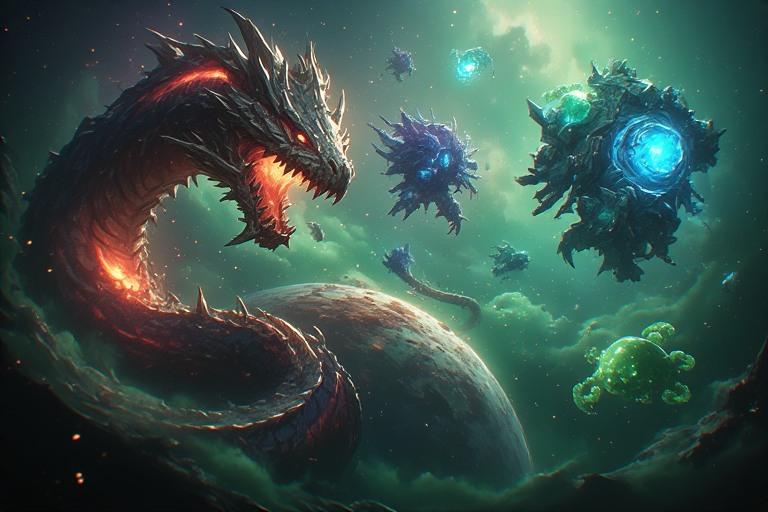

# Чудовища Бездны (Deep Space Horror)



Модификация добавляет в галактику **трёх гигантских космических чудовищ** — Амёбу, Стража и Левиафана. Каждое из них — одновременно «планета»-объект галактики и флот. Чудовища постоянно перемещаются по вселенной, а когда рядом с их точкой выхода (Порталом Бездны) оказываются обитаемые планеты — происходит автоматическая битва.

Мод создан как **тестовый полигон** для модо-дружественного боевого движка и кастомных объектов галактики (задача [#189](https://github.com/ogamespec/ogame-opensource/issues/189)): левиафаны используют специальную мульти-атаку по нескольким планетам сразу, а бой ведётся фронтендом движка без правок его бэкенда.

> **Внимание:** это не сбалансированный игровой контент, а демонстрационный мод. Числовые значения подобраны для наглядности и могут меняться.

---

## Содержание

- [Чудовища](#чудовища)
- [Портал Бездны и перемещение](#портал-бездны-и-перемещение)
- [Битвы](#битвы)
- [Трофеи](#трофеи)
- [Возрождение](#возрождение)
- [Установка](#установка)
- [Структура мода](#структура-мода)
- [Тестирование](#тестирование)
- [Локализация](#локализация)

---

## Чудовища

Каждое чудовище существует в единственном экземпляре на вселенную и появляется при установке мода.

| Чудовище | Планета | Флот (юнит) | Роль |
|---|---|---|---|
| **Амёба** («Планктонный Пожиратель») | `PTYP_LEVI_AMOEBA` | `GID_LEVI_AMOEBA` | Пожиратель лёгких флотов, роняет дейтерий |
| **Страж** («Блуждающий Монолит») | `PTYP_LEVI_GUARDIAN` | `GID_LEVI_GUARDIAN` | Тяжёлый «танк», бьёт по кораблям и обороне, роняет кристалл |
| **Левиафан** («Галактический Исполин») | `PTYP_LEVI_JUGGERNAUT` | `GID_LEVI_JUGGERNAUT` | Эндгейм-босс, роняет металл |

### Параметры (структура / щит / атака / груз / скорость / потребление)

| Чудовище | Параметры | Скорострел против |
|---|---|---|
| Амёба | 250 000 000 / 10 000 / 5 000 / 0 / 100 / 0 | лёгкие корабли, переработчики, зонды, ракеты |
| Страж | 600 000 000 / 100 000 / 50 000 / 0 / 500 / 0 | линкоры, крейсеры, бомбардировщики, тяжёлая оборона |
| Левиафан | 1 200 000 000 / 500 000 / 250 000 / 0 / 50 / 0 | почти всё; низкий скорострел по Звёздам Смерти (5) |

Юниты добавлены в дерево технологий, но **построить их нельзя** — для объектов-планет нет соответствующих колонок в БД, поэтому игроки могут только воевать с чудовищами.

## Портал Бездны и перемещение

У каждого чудовища есть **Портал Бездны** (`PTYP_LEVI_PORTAL`) — точка выхода гиперпрыжка, отдельный объект галактики. Чудовище «летит» к своему порталу флотом с заданием *«Подготовка к гиперпереходу»* (`FTYP_LEVI_PREPARE_JUMP`). Когда флот прибывает, чудовище занимает точку портала, портал уничтожается, происходит битва, а затем создаётся новый портал по правилу перемещения конкретного чудовища — и цикл повторяется.

Длительность полёта зависит от расстояния, параметров вселенной (`fspeed`) и уровня двигателей топ-1 игрока, поэтому частота «прыжков» живая, а не фиксированная.

Правило выбора следующей точки уникально для каждого чудовища:

| Чудовище | Правило перемещения |
|---|---|
| **Амёба** | Дрейфует рядом: с вероятностью 70% меняется только позиция (P, 1–15); в остальных случаях с вероятностью 25% меняется система (S ±5) и с вероятностью 5% — галактика (G ±1). |
| **Страж** | Движется по спирали с края вселенной (G=1, S=1, P=1): проходит все позиции системы, затем переходит в следующую систему; дойдя до края галактики, меняет галактику и разворачивается. Путь можно предсказать, отслеживая чудовище. |
| **Левиафан** | Совершает прыжки: с вероятностью 60% уходит в случайную галактику; система выбирается в центре галактики (центр ± systems/4), позиция случайная. |

## Битвы

Когда флот чудовища прибывает в точку портала, автоматически начинается бой. Чудовище атакует **ковровой бомбардировкой** сразу все обычные планеты (`PTYP_PLANET`) в радиусе:

| Чудовище | Радиус поражения |
|---|---|
| Амёба | P ± 1 |
| Страж | P ± 2 |
| Левиафан | P ± 3 |

В битве участвуют флоты планет в радиусе поражения и их оборона, а также союзные флоты в ожидании (ACS). У боя больше раундов, чем у обычного (Амёба +1, Страж +2, Левиафан +3). Потери защитников списываются по итогам боя (корабли, оборона с учётом ремонта, флоты в ожидании), обновляется активность планет и статистика игроков. Если чудовище выжило — оно прыгает дальше.

С чудовищами и порталом можно взаимодействовать из галактики: шпионаж, скан фалангой (виден флот и время до прыжка), а администратору — управление объектом. Флоты чудовищ также отображаются в списках флотов.

## Трофеи

Если защитники уничтожили чудовище, его останки распределяются **между участниками обороны пропорционально нанесённому урону** (вклад оценивается по суммарной атаке флота и обороны с учётом уровня оружейной технологии):

| Чудовище | Трофей |
|---|---|
| Амёба | 2 500 000 дейтерия |
| Страж | 10 000 000 кристалла |
| Левиафан | 40 000 000 металла |

Доля доставляется на планету участника (для флотов в ожидании — на планету вылета флота), каждому участнику приходит личное сообщение с суммой. Всем игрокам вселенной рассылается броадкаст об уничтожении чудовища с картинкой.

## Возрождение

Убитое чудовище **возрождается в случайной точке вселенной через 24–72 реальных часа**: мод планирует одноразовое событие очереди (`DeepSpaceHorror`), и когда оно срабатывает, создаётся новый экземпляр чудовища (планета + портал + флот). Если чудовище данного типа ещё живо, событие возрождения его не дублирует.

## Установка

Мод подключается через админ-панель (`pages_admin/admin_mods.php`), как и любой другой мод репозитория:

1. Добавьте мод `DeepSpaceHorror` в список активных (`modlist`).
2. Активируйте его — `install()` добавит колонки левиафанов в таблицы `fleet`/`fleetlogs` и создаст чудовищ с порталами.

При удалении мода (`uninstall()`) удаляются все чудовища, порталы, их флоты и события возрождения, а колонки из БД убираются.

Поддерживаемые языки: **русский, английский**.

## Структура мода

```
game/mods/DeepSpaceHorror/
├── main.php              # класс DeepSpaceHorror (GameMod): чудовища, порталы, бои, трофеи, возрождение
├── manifest.json         # описание мода
├── Readme.md             # этот документ
├── img/                  # картинки (чудовища, порталы, фоны, сообщения о победе)
├── loca/                 # локализация
│   ├── en_en/leviathans.php
│   └── ru_ru/leviathans.php
└── testing/              # отдельный PHPUnit-сьют мода (см. «Тестирование»)
```

### Основные хуки мода

| Хук | Назначение |
|---|---|
| `install` / `uninstall` | Колонки БД, создание/удаление чудовищ, очистка событий возрождения. |
| `install_tabs_included` | Колонки левиафанов при создании новой вселенной. |
| `init` | Регистрация юнитов (параметры, скорострел) и локализации. |
| `get_planet_small_image` / `get_planet_image` / `get_object_image` | Картинки объектов галактики и юнитов. |
| `page_flotten2_planet_types` / `page_flottenversand_ajax_spy_planets` | Чудовища и порталы как цели на страницах флота и шпионажа. |
| `page_galaxy_custom_object` | Инфопанель (overlib) чудовищ и порталов в галактике. |
| `fleet_handler` | Обработка прибытия флота «Подготовка к гиперпереходу» (прыжок, битва). |
| `update_queue` | Событие возрождения убитого чудовища. |

Битва с чудовищем исполняется **фронтендом боевого движка** (`ExecuteBattle`, файл `game/core/battle.php`) без изменений его бэкенда (`battle_engine.php`).

## Тестирование

Юнит-тесты мода вынесены **внутрь модификации** как самостоятельный PHPUnit-сьют, чтобы не засорять общий набор тестов проекта:

- `testing/DeepSpaceHorrorTest.php` — тесты чистой логики (хуки изображений и объектов галактики, правила перемещения порталов, таблица трофеев).
- `testing/DeepSpaceHorrorDbTest.php` — тесты против in-memory БД (установка/удаление, возрождение, списание потерь защитников, дележ трофея).
- `testing/phpunit.xml` — собственная конфигурация PHPUnit.
- `testing/bootstrap.php` — загрузка игрового ядра и мода.

Запуск:

```bash
vendor/bin/phpunit -c game/mods/DeepSpaceHorror/testing/phpunit.xml
```

## Локализация

Файлы локализации лежат в `loca/{ru_ru,en_en}/leviathans.php` и подгружаются автоматически (`loca_add`) для русского и английского — языков, на которых поддерживается мод. Имена планет при создании берутся из языка вселенной.
