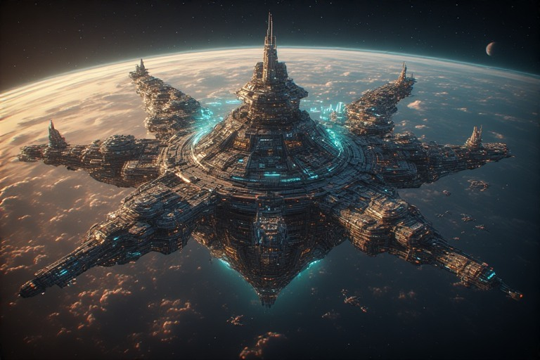

# Странствующий Торговец



```
Придумай механику для модификации OGame - Странствующий Торговец.
Смысл такой что у игрока есть только один объект галактики - его станция, на которой он может в ограниченном виде что-то строить или исследовать. игрок управляющий станцией может делать прыжки по вселенной (продумай механику) и торговать с другими игроками по аналогии со Скупщиком. Продумай все ньюансы и может быть предложишь какие-то интересные особенности механики данной модификации. Также предложи несколько вариантов названия модификации на русском и английском, а также запрос для генератора картинок для станции (для отображения на странице Галактика).
```

Отличная концепция! Вот проработанная механика модификации, предлагающая новый, более динамичный и социально-ориентированный игровой процесс.

Основная концепция
Игрок — капитан уникальной «Бродячей Станции» (космической базы-корабля), единственной и неповторимой. Цель: не завоевать галактику, а стать самым богатым, влиятельным и известным торговцем, разведчиком и посредником, путешествуя между кластерами игроков классического OGame.

Ключевые механики
1. Станция и её развитие
Единый объект: У игрока только одна Станция. Её уровень и модули определяют все возможности.

Модульная система: Вместо отдельных построек — устанавливаемые модули с ограниченным количеством слотов (увеличивается с уровнем базы станции — «Центрального Ядра»).

Производственные модули: Ограниченные версии шахт (металл/кристалл/дейтерий), солнечной саттелиты. Производство ниже, чем у планет.

Торговые модули: Увеличивают вместимость грузовых отсеков, скорость погрузки/разгрузки, количество активных торговых сделок.

Исследовательский модуль: Позволяет проводить исследования, но медленнее, чем в лаборатории обычной планеты.

Оборонительный модуль: Устанавливает ограниченный набор стационарных орудий (не флот). Сила обороны сильно уступает обычной планете.

Двигательный модуль: Влияет на дальность и скорость прыжка (см. ниже).

Модуль маскировки/сканирования: Позволяет скрывать станцию от чужих сканеров или, наоборот, детальнее сканировать других.

2. Механика прыжков (путешествий)
Система секторов: Галактика делится не только на галактики/системы/позиции, но и на «Сектора» (кластеры из нескольких сотен систем). Станция находится в конкретной системе внутри сектора.

Прыжковый двигатель (Дейтериевый): Для прыжка в другой Сектор требуется:

Большое количество дейтерия (основной расходный ресурс механики).
Время на подготовку прыжка (зависит от уровня двигательного модуля).
Цель: Игрок выбирает не конкретную систему, а Сектор. Внутри сектора он появляется в случайной незанятой системе.
«Перескок» внутри сектора: Перемещение между системами одного сектора происходит быстро, с помощью обычных двигателей (малые затраты дейтерия, высокие скорости).

Коэффициент опасности сектора: Некоторые сектора могут быть помечены как «опасные» (выше шанс встречи с NPC-пиратами или бонус к силе атакующих игроков), но ресурсы там дешевле или есть уникальные товары.

Кулдаун: После межсекторного прыжка накладывается кулдаун (1-12 часов), в течение которого нельзя прыгать снова, но можно двигаться внутри сектора.

3. Механика торговли (расширенный «Скупщик»)
Торговая биржа: Игрок может выставлять лоты на межгалактическую биржу. Ключевая особенность: комиссия биржи динамична и зависит от расстояния (в секторах) между продавцом и покупателем. Чем дальше, тем выше комиссия (дейтерий уходит «на логистику»).

Прямые сделки: Игрок может, находясь в одном секторе с другим игроком, предложить прямую сделку с минимальной комиссией. Это поощряет «караванную» торговлю и формирование торговых путей.

Торговые контракты: Возможность заключить долгосрочный контракт на поставку ресурсов (например, 10% от добычи металла ежедневно в обмен на кристаллы). Контракт действует, пока стороны находятся в одном секторе, или до его расторжения.

Уникальные товары: В результате исследований или нахождения в особых секторах можно производить/добывать уникальные ресурсы (например, «Квантовые процессоры», «Экзотическая биомасса»), которые высоко ценятся на бирже и нужны для улучшений.

4. Взаимодействие с классическими игроками
Станция как торговая точка: Классические игроки могут отправлять свои флоты к «Бродячей Станции» для сделок, если она находится в их секторе. Это делает станцию желанным гостем в густонаселенных кластерах.

Услуги: За ресурсы станция может оказывать услуги:

Ремонт флота: Восстанавливает часть HP чужих кораблей (кроме погибших в бою с игроком).

Сканирование: Заплатив, можно получить отчет о активности в соседних системах сектора.

Брокер: Помощь в поиске выгодных сделок на бирже за процент.

Уязвимость: Станцию можно атаковать. Но при уничтожении она не исчезает, а «эвакуируется» в случайную точку галактики с большими потерями ресурсов и долгим восстановлением модулей. Это не катастрофа, но серьезная неудача.

5. Особенности и «фишки»
Книга контактов: Автоматическое сохранение данных об игроках, с которыми заключались сделки. Можно ставить «репутационные» оценки.

Динамическая экономика: Цены на бирже могут слегка колебаться в зависимости от объема сделок в конкретном секторе.

События «Зов Торговца»: Раз в неделю NPC «Гильдия Торговцев» объявляет о необходимости доставить крупную партию товара в определенный сектор. Все бродячие станции получают контракт; тот, кто первым доставит товар, получает награду.

Система достижений/титулов: «Король черного рынка», «Первопроходец далеких секторов», «Дипломат» и т.д., дающие небольшие бонусы.

Названия
На русском:

OGame: Бродячий Торговец (просто и понятно)

OGame: Станция-Скиталец (более фантастическое)

OGame: Галактическая Биржа (акцент на экономике)

На английском:

OGame: The Rogue Trader (отсылка к Warhammer 40k, стильно)

OGame: Nomad Station (современно и по сути)

OGame: Deep Space Merchant (описательно)

Запрос для генератора изображений станции
Для страницы галактики нужна иконка/аватар станции. Запрос должен быть в едином стиле с OGame (полуреалистичная 3D-графика, темный космос).

Запрос на русском/английском для нейросети (например, Midjourney):

text
**Русский:** Космическая станция-корабль, гибрид торговой базы и грузового судна, множество модулей и антенн, синие огни двигателей, в фантастическом стиле, 3D рендер, темный космический фон, вид сбоку, изометричная проекция, детализированная, стиль игры OGame.
text
**English:** A spaceship-station, hybrid of a trade outpost and a cargo freighter, numerous modules and antennas, blue engine glow, sci-fi style, 3D render, dark space background, side view, isometric projection, detailed, OGame game style.
Ключевые слова для вариаций: modular, asymmetrical design, grungy, practical, container modules, large radar dish.

Резюме механики
Эта модификация смещает фокус с войны и экспансии на логистику, риск, социальное взаимодействие и стратегическое планирование. Игрок должен думать как настоящий купец: где дефицит, куда везти товар, как избежать опасностей, с кем строить долгосрочные отношения. Он добавляет в OGame живой, динамичный элемент, который не разрушает основную игру, а обогащает её, создавая новый тип игроков-партнеров для классических императоров.

```
придумай запрос для генератора картинок для заднего фона модификации (бекграунд), отражающий суть модификации
```

Отличная идея! Фоновое изображение должно передавать дух странствий, торговли и бескрайнего космоса. Вот несколько вариантов запросов, от более общих к более сюжетным.

Запрос 1: Акцент на путешествии и торговых путях
Этот вариант подчеркивает масштаб, движение и связность — ключевые элементы для купца.

text
**English:** Epic wide-angle view from the bridge of a spaceship. A trade caravan of diverse freighters and modular stations travels through a vibrant nebula. Glowing trade routes and jump gate tracers connect distant star clusters. Cinematic, dark space with colorful gas clouds, sense of journey and commerce. Digital art, 3D render, ultra-detailed, OGame aesthetic.
text
**Русский:** Эпичный вид с широким углом обзора с мостика космического корабля. Торговый караван из разнообразных грузовых судов и модульных станций путешествует через яркую туманность. Светящиеся торговые пути и следы прыжковых врат соединяют далекие звездные скопления. Кинематографичный, темный космос с красочными газовыми облаками, ощущение путешествия и коммерции. Цифровое искусство, 3D-рендер, очень детализировано, эстетика OGame.
Запрос 2: Акцент на самой станции и её активности
Этот вариант делает игровой объект — вашу станцию — центром композиции, показывая её как оживленный хаб.

text
**English:** A bustling nomadic space station, the 'Rogue Trader', docked at a large asteroid. Small shuttles fly around, transferring containers. Holographic trade interface and star maps are projected in the foreground. In the background, a wormhole or jump portal is active. Warm interior lights contrast with the cold void of space. Detailed, realistic 3D render, deep colors.
text
**Русский:** Шумная кочевая космическая станция «Бродячий Торговец», пристыкованная к крупному астероиду. Вокруг летают челноки, перегружая контейнеры. На переднем плане спроецированы голографический торговый интерфейс и звездные карты. На заднем плане активна червоточина или прыжковый портал. Теплый свет изнутри контрастирует с холодной пустотой космоса. Детализированный, реалистичный 3D-рендер, глубокие цвета.
Запрос 3: Абстрактно-символичный (для минималистичного или главного меню)
Этот запрос создает атмосферное изображение, передающее концепцию через символы.

text
**English:** A lone, rugged spaceship-station sits in the foreground, illuminated by a single star. A complex, glowing web of lines (representing trade routes and jump paths) spreads across the entire starfield behind it, connecting hundreds of distant stars. Moody, atmospheric, concept art style. Sense of solitude, network, and potential. Dark blue and gold color palette.
text
**Русский:** Одинокий, грубоватый корабль-станция стоит на переднем плане, освещенный светом одинокой звезды. Сложная, светящаяся паутина линий (изображающая торговые пути и маршруты прыжков) раскинулась на всем фоне звездного поля позади, соединяя сотни далеких звезд. Мрачная, атмосферная работа в стиле концепт-арта. Ощущение одиночества, сети и потенциала. Цветовая палитра: темно-синий и золотой.
Запрос 4: Динамичный и опасный (для секторов с высокой угрозой)
Этот вариант отражает рискованную сторону механики — не все путешествия безопасны.

text
**English:** Dramatic scene. A modular trade station is making an emergency jump, leaving a bright energy trail. In pursuit are sleek, aggressive pirate ships firing lasers. The scene is set against the backdrop of a dangerous red nebula and a black hole. Motion blur, dynamic composition, sense of urgency and escape. Sci-fi artwork, digital painting.
text
**Русский:** Драматичная сцена. Модульная торговая станция совершает аварийный прыжок, оставляя яркий энергетический след. В погоне несутся строгие, агрессивные пиратские корабли, ведя огонь из лазеров. Сцена разворачивается на фоне опасной красной туманности и черной дыры. Размытие в движении, динамичная композиция, ощущение срочности и побега. Научно-фантастическая иллюстрация, цифровая живопись.
Рекомендация: Для основного фона сайта или главного меню лучше всего подойдет Вариант 1 или 3. Они масштабны, не перегружены деталями и создают нужное настроение. Вариант 2 идеален для промо-материалов или загрузочного экрана, а Вариант 4 можно использовать для тематических событий или разделов, связанных с боем.

```
на картинках станции которые ты предложил получаются скорее корабли, чем торговая станция. нужно переработать запрос (англ.) для картинки станции
```

Совершенно верно, предыдущие запросы смещали акцент в сторону корабля. Нужно сделать станцию более массивной, модульной и "базовой". Вот переработанные запросы, акцентирующие именно станцию как передвижную базу, а не просто большой корабль.

Ключевые изменения в запросе:
Основной фрейм: massive modular space station (массивная модульная космическая станция).

Ядро: Добавляем central core или habitat ring (обитаемое кольцо) — элемент, который явно указывает на постоянное проживание.

Структура: Добавляем docked freighters (пристыкованные грузовые суда) или external docking arms (внешние стыковочные руки) — это сразу показывает функцию и масштаб.

Стиль: Уходим от "spaceship" и используем industrial, asymmetric, practical design (индустриальный, асимметричный, практичный дизайн).

Запрос 1: Классическая массивная модульная станция
Акцент на модульности, промышленности и функциях торгового хаба.

text
A massive, asymmetric, modular deep-space trade station. Central cylindrical habitat core with multiple docked freighters and cargo pods. Large solar panel arrays, prominent communication dishes, and external docking arms. Industrial, gritty, practical design, with visible hull plating and external piping. Surrounded by small trading shuttles in a busy asteroid field. Dark space with a nebula in the background. Isometric view, 3D render, highly detailed, sci-fi realism, OGame style.
*(Массивная, асимметричная, модульная торговая станция дальнего космоса. Центральное цилиндрическое обитаемое ядро с несколькими пристыкованными грузовыми судами и грузовыми контейнерами. Большие массивы солнечных панелей, выступающие коммуникационные тарелки и внешние стыковочные стрелы. Индустриальный, потертый, практичный дизайн с видимой броней и внешней обвязкой. Окружена мелкими торговыми челноками в оживленном астероидном поле. Темный космос с туманностью на фоне. Изометричный вид, 3D-рендер, высокая детализация, научно-фантастический реализм, стиль OGame.)*

Запрос 2: Станция-форпост на астероиде
Идея станции, которая не просто летает, а временно "оседает" на астероиде для добычи и торговли.

text
A rugged, sprawling trade outpost built into and around a large, craggy asteroid. The station is a cluster of interconnected modular habitats, storage silos, and refinery units. Docking bays are carved directly into the asteroid rock. Cargo cranes and loading arms are active. Glowing lights from viewports and refueling stations create a sense of life. The design is functional and improvised. View from above, 3D render, sci-fi, industrial aesthetic.
*(Грубый, раскинувшийся торговый форпост, встроенный в и вокруг большого скалистого астероида. Станция представляет собой скопление взаимосвязанных модулей-обитателей, силосов для хранения и перерабатывающих блоков. Стыковочные отсеки вырублены прямо в скальной породе астероида. Грузовые краны и погрузочные стрелы активны. Светящиеся огни из иллюминаторов и заправочных станций создают ощущение жизни. Дизайн функциональный и импровизированный. Вид сверху, 3D-рендер, научная фантастика, индустриальная эстетика.)*

Запрос 3: Футуристичный, но хаотичный торговый хаб
Сочетание высоких технологий с видимой хаотичностью роста "на живую".

text
A futuristic yet cluttered and chaotic deep-space trading hub. The station has a geometric central core, but it is heavily encrusted with added-on modules, shipping containers repurposed as habitats, and gantry docks for ships of various sizes. Holographic advertisements and trade route displays flicker across its surface. The overall shape is irregular and organic due to constant expansion. Surrounded by a dense cloud of small vessels. Cinematic 3D render, neon and industrial lighting, hyper-detailed.
*(Футуристичный, но загроможденный и хаотичный торговый хаб дальнего космоса. Станция имеет геометрическое центральное ядро, но оно сильно обрастает добавленными модулями, переоборудованными под жилые помещения грузовыми контейнерами и рампами для кораблей разных размеров. По поверхности мерцают голографическая реклама и дисплеи с торговыми маршрутами. Общая форма неправильная и органичная из-за постоянного расширения. Окружена плотным облаком мелких судов. Кинематографичный 3D-рендер, неоновое и индустриальное освещение, сверхдетализировано.)*

Совет: Если генератор все еще выдает слишком "корабельные" формы, попробуйте добавить или усилить в запросе следующие негативные промпты (negative prompt):

spaceship, sleek, aerodynamic, streamlined, warship, fighter

no large engines, no thrusters, no prow

stationary, slow-moving

Эти запросы должны сместить восприятие нейросети в сторону именно базы, а не судна.

```
на картинке заднего фона тоже какие-то корабли и зачем-то летят в портал. нужна тематика торговой станции
```

Понял! Убираем лишнюю динамику, корабли и порталы. Фокус — на самой торговой станции как на центральном, монументальном и единственном объекте игрока, окруженном атмосферой космической изоляции, но с намёком на деловую активность.

Вот три переработанных запроса, где станция — абсолютный главный герой кадра.

Запрос 1: Уединённая база в глубинах космоса
Акцент на самодостаточности, изоляции и индустриальной эстетике вашего дома-крепости.

text
**English:** A massive, rugged, modular deep-space trade station. Asymmetric design with a central habitat ring, large solar arrays, and multiple docking arms. The station is illuminated from within, glowing with warm light in countless viewports. It floats alone in the silent, infinite void of dark space, tethered to a small asteroid for raw materials. A single, distant nebula provides a soft backdrop. Moody, cinematic, hyper-detailed 3D render. Sense of solitude, industry, and self-sufficiency. OGame aesthetic, realistic textures, industrial sci-fi.
Ключевые слова: modular space station, central habitat ring, industrial, asymmetric, alone in the void, glowing interior lights, self-sufficient.

Запрос 2: Спокойный торговый хаб на орбите (статичная сцена)
Станция как оживлённая, но не суетливая точка притяжения. Акцент на её архитектуре и функциях.

text
**English:** A majestic, permanently orbiting trade station above a gas giant with rings. The design is functional and imposing: a geometric core with attached modular sectors (habitation, storage, refinery). Several freighters are statically docked at its ports, not flying. Holographic trade sigils and identification codes are projected calmly onto its hull. The scene is calm, static, and grand. Wide-angle view, epic scale, detailed 3D render, serene space atmosphere. Focus on the station's architecture.
Ключевые слова: orbiting trade station, geometric core, static docked freighters, holographic trade signs, calm scene, imposing architecture, serene.

Запрос 3: Концепт-арт для интерфейса (минимализм + детали)
Идеально для фона интерфейса или загрузочного экрана. Станция крупным планом, все детали видны.

text
**English:** Close-up, isometric view of a nomadic trade station's main complex. Focus on intricate industrial details: hull plating, exposed pipes, airlocks, communication arrays, and cargo cranes. A few small, inactive cargo pods are attached. The background is a deep, clean starfield with a subtle color gradient (dark blue to black). Sharp focus, studio lighting, clean 3D render, concept art style. The image conveys functionality, customization, and a personal home in space.
Ключевые слова: close-up isometric view, nomadic trade station, industrial details, hull plating, cargo cranes, clean starfield background, concept art, personal home.

Ключевые принципы новых запросов:
Нет лишнего движения: Никаких летящих кораблей, следов от двигателей или активных порталов.

Станция — центр вселенной: Она занимает центральное место в композиции, она массивна и детализирована.

Атмосфера вместо действия: Настроение задаётся светом (тёплый свет из иллюминаторов), масштабом (огромная станция на фоне бесконечного космоса) и статичной, "позирующей" композицией.

Функции видны, но статичны: Грузовые стрелы, пристыкованные корабли (как часть станции), солнечные панели — всё есть, но ничего не двигается в кадре.

Рекомендация: Для основного фона лучше всего подойдёт Запрос 1. Он идеально передаёт суть модификации: вы одиноки во вселенной, ваш дом — это ваша станция, и она — воплощение вашего прогресса и богатства.